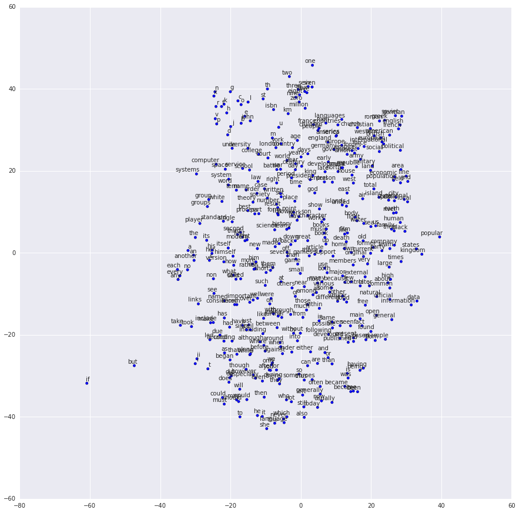

[reference document](https://www.tensorflow.org/tutorials/word2vec)

`Similiar concept

word embedding
Distributed semantic model
Distributed representation
Semantic vector space
Vector space model

## Motivation

Image and audio processing systems work with rich, high-dimensional datasets encoded as vectors of the individual raw pixel-intensities for image data, or e.g. power spectral density coefficients for audio data. For tasks like object or speech recognition we know that all the information required to successfully perform the task is encoded in the data (because humans can perform these tasks from the raw data).

However, natural language processing systems traditionally treat words as discrete atomic symbols, and therefore 'cat' may be represented as Id537 and 'dog' as Id143. These encodings are arbitrary, and provide no useful information to the system regarding the relationships that may exist between the individual symbols. This means that the model can leverage very little of what it has learned about 'cats' when it is processing data about 'dogs' (such that they are both animals, four-legged, pets, etc.). Representing words as unique, discrete ids furthermore leads to data sparsity, and usually means that we may need more data in order to successfully train statistical models. Using vector representations can overcome some of these obstacles.

Vector space models (VSMs) represent (embed) words in a continuous vector space where semantically similar words are mapped to nearby points ('are embedded nearby each other'). VSMs have a long, rich history in NLP, but all methods depend in some way or another on the Distributional Hypothesis, which states that words that appear in the same contexts share semantic meaning. The different approaches that leverage this principle can be divided into two categories:
* count-based methods (e.g. Latent Semantic Analysis)
*  predictive methods (e.g. neural probabilistic language models).

Count-based methods compute the statistics of how often some word co-occurs with its neighbor words in a large text corpus, and then map these count-statistics down to a small, dense vector for each word. Predictive models directly try to predict a word from its neighbors in terms of learned small, dense embedding vectors (considered parameters of the model.

Word2vec is a particularly computationally-efficient predictive model for learning word embeddings from raw text. It comes in two flavors, the Continuous Bag-of-Words model (CBOW) and the Skip-Gram model. Algorithmically, these models are similar, except that CBOW predicts target words (e.g. 'mat') from source context words ('the cat sits on the'), while the skip-gram does the inverse and predicts source context-words from the target words. This inversion might seem like an arbitrary choice, but statistically it has the effect that **CBOW smoothes over a lot of the distributional information (by treating an entire context as one observation). For the most part, this turns out to be a useful thing for smaller datasets**. However, **skip-gram treats each context-target pair as a new observation, and this tends to do better when we have larger datasets**. We will focus on the skip-gram model in the rest of this tutorial.


## Prepare Input Data
### Data requirements of Skip-gram model
Example:
given following data:

`the quick brown fox jumped over the lazy dog`

Because Skip-Gram model try to predict context from target word.
So the task is:
* predict `the` and `brown` from `quick`
* predict `quick` and `fox` from `brown`

Transform following example into (input, output) format:

`(quick, the), (quick, brown), (brown, quick), (brown, fox)`

### Generate Input Data for Skip-Gram model
[github](https://github.com/tensorflow/tensorflow/blob/master/tensorflow/examples/tutorials/word2vec/word2vec_basic.py)

#### Meaning of parameters:

* skip_window: How many words to consider left and right.
* num_skips: How many times to reuse an input to generate a label.

```
def generate_batch(batch_size, num_skips, skip_window):
  import pdb; pdb.set_trace()
  global data_index
  assert batch_size % num_skips == 0
  assert num_skips <= 2 * skip_window
  batch = np.ndarray(shape=(batch_size), dtype=np.int32)
  labels = np.ndarray(shape=(batch_size, 1), dtype=np.int32)
  span = 2 * skip_window + 1  # [ skip_window target skip_window ]
  buffer = collections.deque(maxlen=span)
  if data_index + span > len(data):
    data_index = 0
  buffer.extend(data[data_index:data_index + span])
  data_index += span
  for i in range(batch_size // num_skips):
    target = skip_window  # target label at the center of the buffer
    targets_to_avoid = [skip_window]
    for j in range(num_skips):
      while target in targets_to_avoid:
        target = random.randint(0, span - 1)
      targets_to_avoid.append(target)
      batch[i * num_skips + j] = buffer[skip_window]
      labels[i * num_skips + j, 0] = buffer[target]
    if data_index == len(data):
      buffer[:] = data[:span]
      data_index = span
    else:
      buffer.append(data[data_index])
      data_index += 1
  # Backtrack a little bit to avoid skipping words in the end of a batch
  data_index = (data_index + len(data) - span) % len(data)
  return batch, labels
```

#### Anatomy of code

Let's start from the inner most loop:

```
for j in range(num_skips):

  while target in targets_to_avoid:

    target = random.randint(0, span - 1)

  targets_to_avoid.append(target)

  batch[i * num_skips + j] = buffer[skip_window]

  labels[i * num_skips + j, 0] = buffer[target]

```
The data in the batch is always the word in the middle, what we need to predict is the 'context' of this word(the word surround it). so we randomly choose one word (without duplication), How many times we should take this word as batch is controlled by `num_skips`

The outer loop:
```
for i in range(batch_size // num_skips):
```
is simply try to generate the requested number of data. which is `batch_size//num_skip
`
## Architecture(graph definition)

### First and most important
* Define embedding matrix

```
embeddings = tf.Variable(
  tf.random_uniform([vocabulary_size, embedding_size],-1.0,1.0)
  )
```

* Define weights and biases for each word

```
nce_weights=tf.Variable(tf.truncate_normal([vocabulary_size, embedding_size],
                    stddev=1.0/math.sqrt(embedding_size)))
nce_biases=tf.Variable(tf.zeros(vocabulary_size))
```

* Define place holder for input data
```
train_inputs=tf.placeholder(tf.int32, shape=[batch_size])
train_labels=tf.placeholder(tf.int32, shape=[batch_size,1])
```
* look up the vector for each of source words in the batch_size

```
embed=tf.nn.embedding_lookup(embeddings, train_inputs)
```

* calculate the loss and define optimizer

```
loss=tf.reduce_mean(
  tf.nn.nce_loss(
    weights=nce_weights,
    biases=nce_biases,
    labels=train_labels,
    input=embed,
    num_sampled=num_sampled,
    num_classes=vocabulary_size
    )
  )
optimizer=tf.train.GradientDescentOptimizer(learning_rate=0.1).minimize(loss)

```
* Train the model

```
for inputs, labels in genereate_batch(...):
  fedd_dict={train_inputs:inputs, train_labels:labels}
  _,cur_loss=session.run([optimizer,loss],fedd_dict=feed_dict)
```


## Check the trained model

### Check similarities

similarities is simply a matrix mult
```
norm = tf.sqrt(tf.reduce_sum(tf.square(embeddings), 1, keep_dims=True))

normalized_embeddings = embeddings / norm

valid_embeddings = tf.nn.embedding_lookup(
    normalized_embeddings, valid_dataset
    )

similarity = tf.matmul(
    valid_embeddings, normalized_embeddings, transpose_b=True)

```

### Visualizeing the Learned Embeddings


